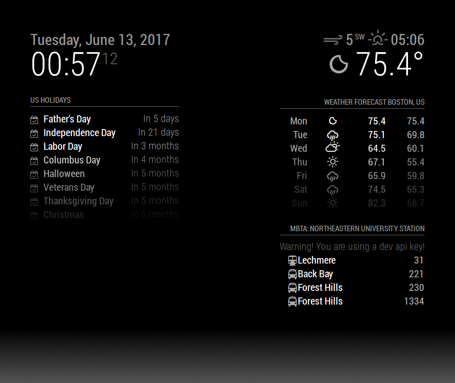

# MMM-MBTA

This MagicMirror² Module is designed to pull information from the Massachusetts Bay Transportation Authority's API and to
show and filter data.

For this to work, you need to create your own MBTA API key. You can get one by following [this link][mbta dev portal] and 
signing up. Note that it may take up to a day to approve your api key, according to their website.


**DISCLAIMER**

The times provided are from MBTA's API. As a result, the predicted values may be off. Please only use this as an estimation. i am not responsible for missed transportation and any consequences as a result of it. This is not a precise tool, nor have I claimed it to be. By using this module, you agree to never assume that this is a precise tool, and that I take no fault in any missed appointments, finals, etc.

## Installation

In your terminal, go to your MagicMirror's Module folder:

```bash
cd ~/MagicMirror/modules
```
Clone this repository:
```bash
git clone https://github.com/edward-shen/MMM-MBTA.git
```
Configure the module in your config.js file.

## Using the module

To use this module, add it to the modules array in the `config/config.js` file:
```js
modules: [
    {
        module: 'MMM-MBTA',
        position: 'top_right', // This can be any of the regions.
        header: "MBTA:",
        config: {
            apikey: 'your_api_key',
        }
    }
]
```

## Configuration options

Option|Description
------|-----------
`apikey`|Api key given by the MBTA.<br/>**Expected Value type:** `String`.
`updateInterval`|Time between updates, in seconds. To protect API abuse, this module automatically limits this value to a minimum of `10`.<br/>**Expected Value type:** `int`.
`baseUrl`|The base url of the MBTA api. You shouldn't change this unless the MBTA moved the api to the new location, and the update hasn't been reflected in this module.<br/>**Expected Value type:** `String`.
`stations`|This is an array of stations that you wish to display. Currently, only one max station is allowed. For a list of station names, please refer to `stations-formatted.json`. Make sure to use the common name!<br/>Example: `stations: [ "Airport" ]`.<br/>**Expected Value type:** `[String, String, ...]`.
`doAnimation`|Whether or not to do an animation when updating.<br/>**Expected Value type:** `boolean`.
`animationSpeed`|How long the update animation lasts. <br/>**Expected Value type:** `int`.
`formatETA`|Show ETA time in MM:SS instead of just seconds.<br/>**Expected Value type:** `boolean`.
`showMinutesOnly`|Show ETA time in minutes only. This overrides `formatETA`.<br/>**Expected Value type:** `boolean`.
`showOnly`|Filter out various modes of transportation. Example: `showOnly: ["Subway"]` would only show subways, while `showOnly: ["Subway", "Bus"]` would show both subways and buses. Default is to show all modes of transportation.<br/>**Expected Value type:** `[String, String, ...]`.<br/>The various options are `Subway`, `Train`, `Bus`, `Ferry`, `Cable car`.
`maxEntries`|The maximum entries allowed. Default is `8`.<br/>**Expected Value type:** `int`.
`maxTime`|The maximum ETA time the modules should list, in minutes. Default is to show all. <br/>**Expected Value type:** `int`.
`showArrivalTime`|Show MBTA's predicted arrival time of the transportation vehicle.<br/>**Expected Value type:** `boolean`.
`showETATime`|Show MBTA's predicted ETA for the vehicle.<br/>**Expected Value type:** `boolean`.

More options will be added as this module becomes feature-rich.

## Planned Features
- [x] Options to display minutes and seconds vesus just seconds
- [ ] Options to display full description name
- [x] Options to display arrival time
- [x] Options to filter various modes of transportation
- [x] Formatting that matches the default modules
- [ ] Alert tickers
- [ ] Fade effect
- [x] Animations
- [x] Cap on maximum amount of vehicles displayed

This list was last updated on 2017-06-14.

## Known Bugs
- On boot up, it takes a very long time to diplay your options

  This can be fixed by setting up a reciever for the system notification `DOM_OBJECTS_CREATED` and start our update loop from there

- Gondola and funicular icons are unsupported!

  This is intentional. Unless there's a Font Awesome icon, or one that resembles one, I'm not adding it in, because there shouldn't be gondolas and funiculars in Boston anyways.

This list was last updated on 2017-06-13.

[mbta dev portal]: http://realtime.mbta.com/Portal/
